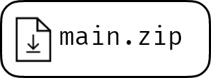
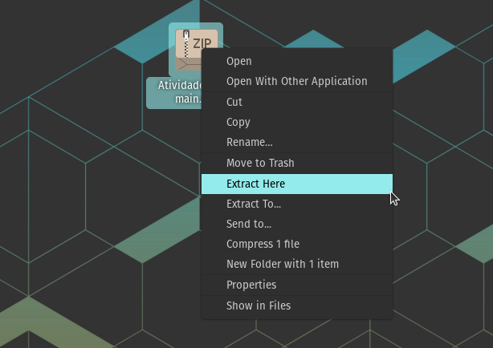

# AtividadeHash

Essa é a atividade 2 de Estrutura de Dados sobre Tabelas Hash!

## Como compilar

### Baixe o ZIP
<a href="https://github.com/erlonL/AtividadeHash/archive/refs/heads/main.zip"></a>

### Extraia o arquivo ZIP


### Abra o terminal na pasta do projeto
```bash
User:~/Downloads/AtividadeHash-main$
```
### Compile o projeto com 'make'
```bash
User:~/Downloads/AtividadeHash-main$ make
g++ -c main.cpp
g++ -c input.cpp
g++ -c hash.cpp
g++ main.o hash.o -o teste.exe
g++ input.o hash.o -o input.exe
```

## Execução
*./*
```bash
User:~/Downloads/AtividadeHash-main$ ./teste.exe

**TABELA COMPLETA**
Tabela 0
0 => {Maria : 12} -> NULL
1 => NULL
2 => NULL
3 => NULL
4 => NULL
[...]
Tabela 9
0 => NULL
1 => NULL
2 => NULL
3 => NULL
4 => NULL
```

```bash
User:~/Downloads/AtividadeHash-main$ ./input.exe "Ana" "Maria" "Pedrinho"...
Nó encontrado!
Chave: Ana
Valor: 10

Nó encontrado!
Chave: Maria
Valor: 12

Nó com chave 'Pedrinho' não encontrado!

[...]
```